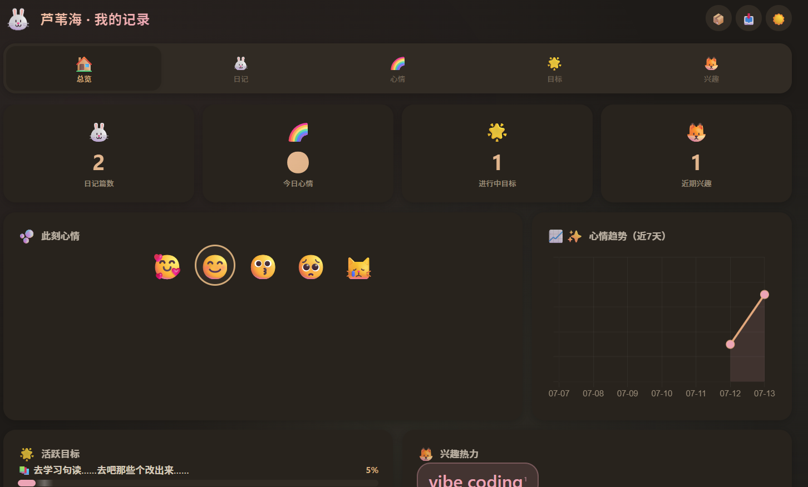
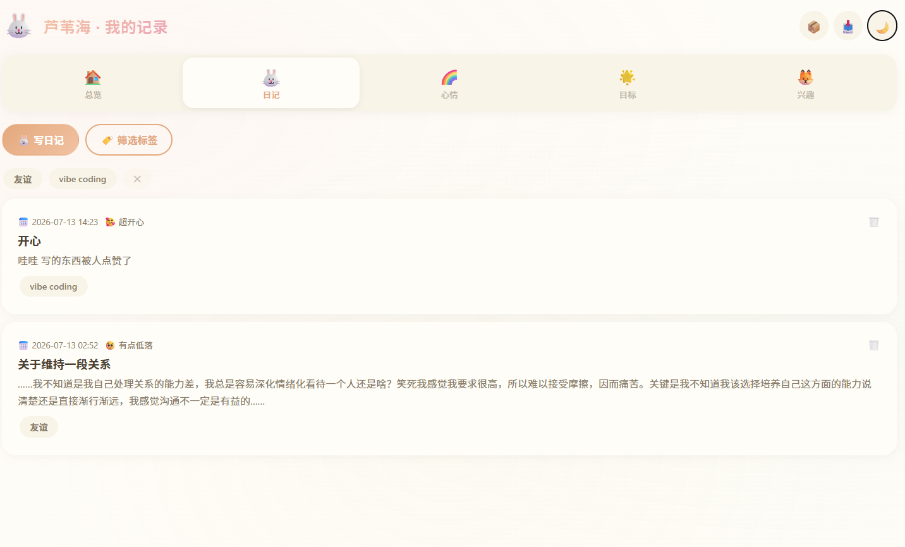
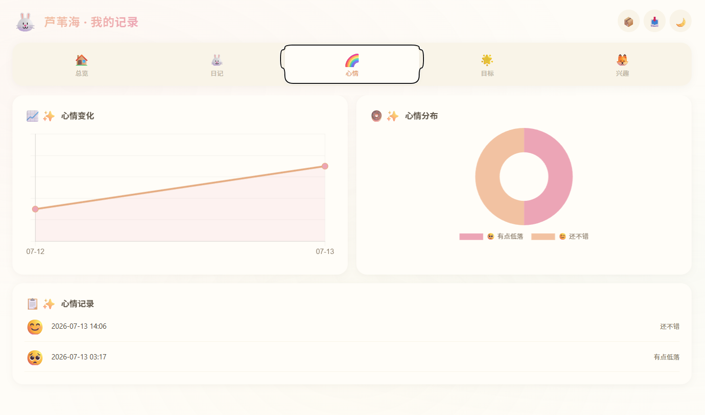
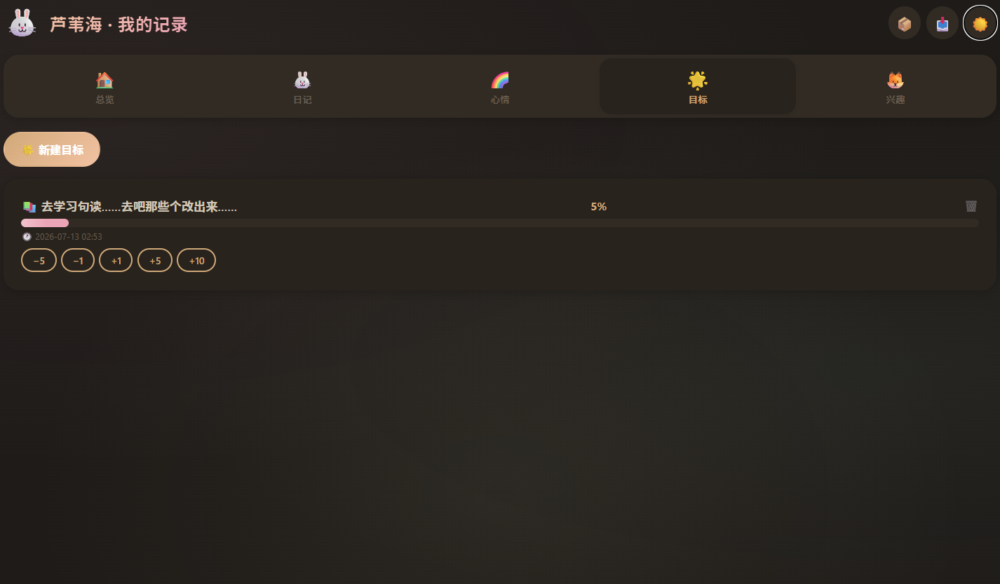
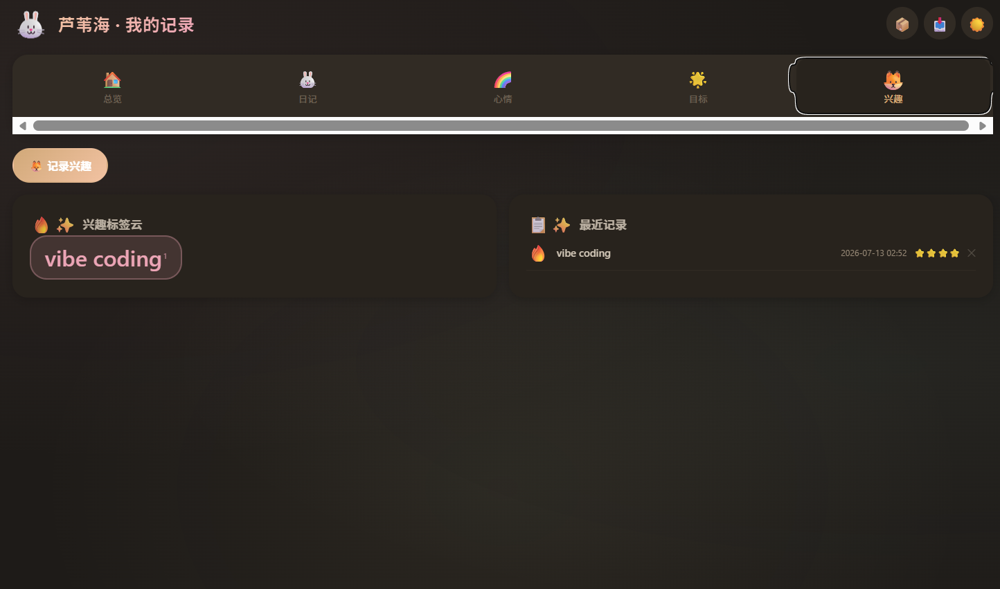

# 🌾 芦苇海 · 我的记录

> 一个 AuDHD 人士写给自己的可视化自我观测工具。
> 单文件 HTML，浏览器打开即用，数据全存在本地。

---

## 为什么做这个

我是 AuDHD（自闭症谱系 + ADHD）。以下场景你可能很熟悉：

- **"我这周心情怎么样？"** — 回答不了，感觉每天都像被抹掉了
- **"上个月我对什么感兴趣来着？"** — 忘了，现在满脑子都是新的 hyperfixation
- **"那个目标我坚持了几天？"** — 不记得开始过
- **"今天到底发生了什么？"** — 时间感知像一滩水，分不清三天前和三周前

我需要一个**极低摩擦**的记录工具——不用注册、不用联网、不用打开 App 等 loading。就是一打开浏览器就能记，记完就能看。

芦苇海就是这样来的。🐰

---

## 功能

| 模块 | 做什么 | 为什么对 AuDHD 有用 |
|------|--------|---------------------|
| 🐰 **日记** | 写日记、打标签、记心情 | 把飘散的思绪锚定下来，标签方便回溯 |
| 🌈 **心情** | 每天选一个 emoji，自动生成趋势图和分布图 | 述情障碍友好——不需要描述"感觉如何"，选个脸就行 |
| 🌟 **目标** | 设定目标，用 ±1/±5/±10 按钮推进度 | 大目标拆成小步，每次点一下就有反馈 |
| 🦊 **兴趣** | 记录当前沉迷的东西，看热度变化 | 观察自己的 hyperfixation 周期，哪些是长期的哪些是闪电式的 |

### 其他小东西
- 🌙 **深色模式** — 感官敏感友好
- 📦 **导出/导入 JSON 备份** — 数据是你自己的，随时带走
- ✨ **点按钮会撒星星** — dopamine hit

---

## 怎么用

1. 下载 `index.html`
2. 浏览器打开
3. 开始记

数据存在浏览器的 localStorage 里。想备份就点右上角 📦 导出成 JSON。换电脑就 📥 导回去。

不需要 `npm install`。不需要网络。不需要数据库。

---

## 技术

纯静态 HTML + 原生 JS + [Chart.js](https://www.chartjs.org/)（CDN 加载）。

没有任何构建工具、没有框架、没有后端。因为我没耐心配环境。🤷

---

## 截图

| 总览 | 日记 |
|------|------|
|  |  |

| 心情图表 | 目标进度 |
|----------|----------|
|  |  |

| 暗色模式 |
|----------|
|  |

---

## 名字

芦苇海 = 埃及神话里的 **Aaru**（Sekhet-Aaru / Field of Reeds）。

就是死后那个天堂——灵魂过了审判，在芦苇原野里过上平静的永恒生活。没有烦恼，没有 deadline，没有"你为什么不按我说的做"。

而我还在现世。所以就有了这个工具。🌾

> 在白话：就是吐槽活着好累，需要一个属于自己的芦苇海。

---

## License

MIT — 随便改、随便用。如果能帮到另一个大脑工作方式不太一样的人，那就太好了。
